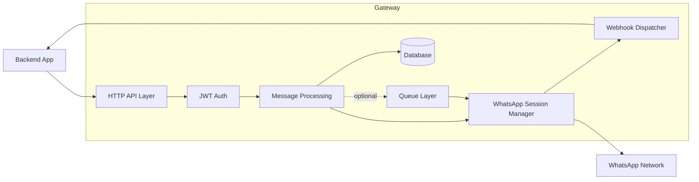
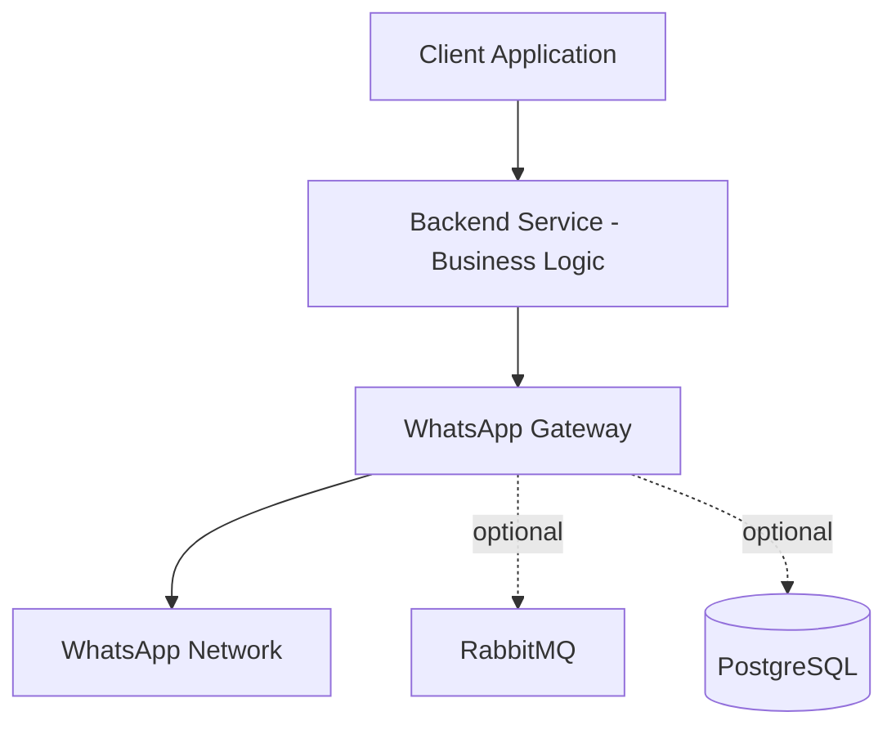

# High-Level Architecture

## Purpose

This document describes the structural architecture of Whatsapp Gateway, including its primary components, data flow, and operational boundaries.

The objective is to provide backend engineers and solution architects with a clear mental model of how the system behaves in production.

## Architectural Overview

Whatsapp Gateway operates as an intermediary service between a backend application and the WhatsApp network.

At a high level, the system consists of:

- HTTP API Layer
- Authentication Layer (JWT)
- Message Processing Layer
- Optional Queue Layer (RabbitMQ)
- WhatsApp Session Manager
- Database Layer
- Webhook Dispatcher

The system is deployed as a single service instance by default, with optional integration to external infrastructure components such as RabbitMQ and PostgreSQL.

## Logical Flow

Outbound Message Flow:

1. Backend sends HTTP request to the gateway.
2. JWT authentication is validated.
3. Rate limiting rules are evaluated.
4. If queue mode is enabled:
   - The message is published to RabbitMQ.
   - A worker consumes and dispatches it to WhatsApp.
5. If queue mode is disabled:
   - The message is dispatched immediately.
6. Message state is persisted in the database.
7. Delivery status updates are received from WhatsApp.
8. Webhook events are sent to the backend.

Inbound Message Flow:

1. WhatsApp pushes an incoming message to the active session.
2. The session manager processes the message.
3. Message metadata is stored in the database.
4. A webhook event is dispatched to the backend.
5. Retry logic applies if webhook delivery fails.

## Component Breakdown

HTTP API Layer

Responsible for:

- Handling REST endpoints
- Validating JWT tokens
- Parsing request payloads
- Returning structured responses

This layer remains stateless. All persistent state is delegated to the database.

Authentication Layer

- JWT-based authentication
- Protects all operational endpoints
- No session cookies or stateful login model

Message Processing Layer

- Enforces rate limiting
- Determines queue or direct dispatch mode
- Tracks message lifecycle
- Updates message status

Queue Layer (Optional)

- External RabbitMQ instance
- Used when queue mode is enabled
- Buffers outbound messages
- Supports controlled dispatch and retry

If disabled, the system operates without any message broker.

WhatsApp Session Manager

- Maintains device session connection
- Handles QR-based login process
- Receives inbound events
- Tracks device state
- Reconnects when necessary

Session state is persisted in the database to survive restarts.

Database Layer

Supported engines:

- PostgreSQL (recommended)
- SQLite

Responsibilities:

- Session persistence
- Message metadata storage
- Delivery status tracking
- Operational state

Database is a required component.

Webhook Dispatcher

Responsible for:

- Sending outbound HTTP webhook events
- Signing payloads using HMAC
- Retrying failed deliveries
- Respecting configured retry limits

Webhook dispatch is asynchronous from message handling.

## Deployment Topology

Recommended topology:

Optional infrastructure components:

- RabbitMQ (for queue mode)
- PostgreSQL (production database)

The gateway is intended to run within a controlled infrastructure environment.

## Concurrency Model

The system operates as a single service process.

Concurrency is handled internally using Go runtime primitives, including goroutines and channels.

When queue mode is enabled:

- Message consumption occurs via worker routines.
- Dispatch throughput is controlled programmatically.

There is no separate worker service in the default architecture.

## Rate Limiting Model

Rate limiting is applied at the gateway instance level.

Behavior depends on queue mode:

Queue Enabled:
- Messages exceeding the immediate limit are buffered.
- Dispatch is controlled and serialized according to configuration.

Queue Disabled:
- Messages exceeding rate limits are rejected immediately.
- No buffering occurs.

This ensures predictable backpressure behavior.

## State Management

Persistent state includes:

- WhatsApp session credentials
- Device login status
- Message lifecycle states
- Delivery acknowledgments

The gateway does not maintain in-memory-only critical state.

System restarts do not invalidate persisted sessions.

## Scalability Considerations

Current architecture is optimized for single-instance deployment.

Horizontal scaling requires:

- Shared database
- Coordinated session management
- Distributed rate limiting
- Queue centralization

Distributed cluster support is planned for future versions but is not currently implemented.

## Architectural Constraints

- Single-instance WhatsApp session per device
- No built-in cluster coordination
- No automatic cross-instance load balancing
- No SLA guarantees

Design decisions prioritize clarity, reliability, and production readiness over premature distributed complexity.
