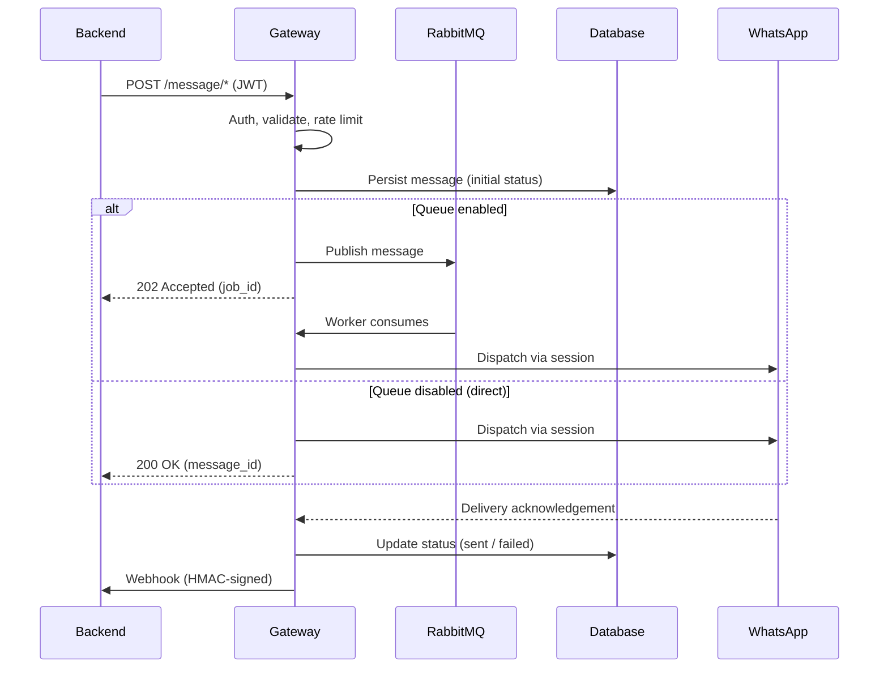
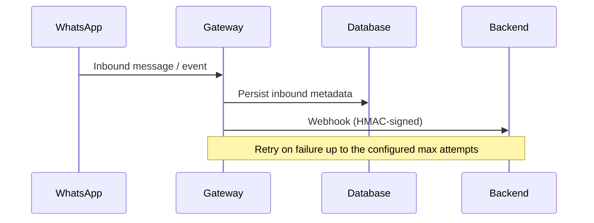

# Message Flow

## Purpose

This document describes the lifecycle of outbound and inbound messages within Whatsapp Gateway. It explains how requests are processed, persisted, dispatched, tracked, and delivered.

Understanding this flow is critical for backend integration, operational planning, and failure handling.

## Outbound Message Flow

The outbound message flow begins when a backend service submits a request to send a message.

### Step 1: API Request Reception

The backend sends an HTTP request to the gateway containing:

- Message payload (text or supported media)
- Target recipient
- Authentication token (JWT)

The gateway:

- Validates JWT authentication
- Validates request structure
- Applies basic input validation

If authentication fails, the request is rejected immediately.

### Step 2: Rate Limit Evaluation

The gateway evaluates configured rate limits.

Behavior depends on queue mode configuration.

Queue Disabled:

- If within rate limit, proceed to immediate dispatch.
- If limit exceeded, the request is rejected with an appropriate error response.

Queue Enabled:

- The message is accepted.
- The message is published to RabbitMQ.
- Dispatch occurs asynchronously via worker routines.

### Step 3: Message Persistence

Persistence applies only in queue mode: after the message is successfully published to RabbitMQ, the gateway writes a job-tracking record to the database. In direct (queue-disabled) mode, no record is persisted before or after dispatch.

Stored information includes:

- Sender account (phone number)
- Timestamp
- Initial status
- Internal tracking identifiers

This ensures traceability and status monitoring.

### Step 4: Message Dispatch

Queue Disabled:

- Message is sent directly to WhatsApp via the active session.
- The request lifecycle may wait for dispatch acknowledgment.

Queue Enabled:

- Worker routine consumes message from RabbitMQ.
- Worker dispatches message to WhatsApp.
- Status updates are recorded in the database.

### Step 5: Delivery Status Tracking

WhatsApp generates delivery-related events.

The gateway:

- Receives delivery acknowledgment
- Updates message status in the database
- Emits corresponding webhook event to the backend

Possible lifecycle states may include:

- Queued
- Sent
- Failed
- Delivered

Exact state transitions are determined by WhatsApp event responses.

### Step 6: Webhook Notification

After state change, the gateway sends a webhook event to the backend.

The webhook:

- Contains event type
- Includes message metadata
- Is signed using HMAC

If webhook delivery fails:

- Retry mechanism is triggered
- Maximum retry attempts are enforced

After exceeding retry limit, no further attempts are made.

## Inbound Message Flow

Inbound flow begins when WhatsApp sends an event to the active device session.

### Step 1: Event Reception

The WhatsApp session manager receives:

- Text messages
- Supported media (image)
- System events

### Step 2: Message Persistence

Inbound message metadata is stored in the database.

Stored data includes:

- Sender identifier
- Message content reference
- Media reference (if applicable)
- Timestamp

### Step 3: Webhook Dispatch

The gateway constructs a webhook payload and sends it to the configured backend endpoint.

The payload is signed using HMAC.

If webhook delivery fails:

- Retry policy is applied
- Attempts stop after configured maximum retry count

## Failure Scenarios

Outbound Failure (Queue Disabled):

- Rate limit exceeded → immediate rejection
- Dispatch failure → status updated as failed
- Webhook failure → retried until max attempts

Outbound Failure (Queue Enabled):

- RabbitMQ unavailable → publish failure
- Worker dispatch failure → retry logic applies
- WhatsApp rejection → status marked as failed

Inbound Failure:

- Database write failure → message not persisted
- Webhook delivery failure → retried according to policy

The gateway does not guarantee eventual delivery beyond configured retry limits.

## Idempotency Consideration

Each API request is treated as a new operation.

The gateway supports optional idempotency keys: a request carrying an `Idempotency-Key` header is deduplicated per account within a configurable window (`IDEMPOTENCY_TTL_SECONDS`, default 86400). A replayed key returns the stored response, the same key with a different body returns 422, and a key whose original request is still in progress returns 409.

If backend systems require deduplication, it must be handled at the application level.

## Observability Points

Critical observable checkpoints:

- API response status
- Database message state
- Webhook event delivery
- Health endpoint status
- WhatsApp login status endpoint

These allow backend systems and monitoring tools to track message lifecycle deterministically.
