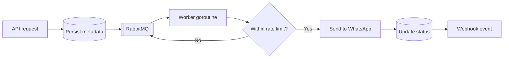

# Queue Processing

## Purpose

This document explains how outbound message queuing works when RabbitMQ integration is enabled. It defines queue behavior, worker processing logic, retry interaction, and rate control enforcement.

Queue processing is optional but recommended for controlled throughput in production environments.

## Queue Mode Overview

Queue mode is controlled via configuration.

When queue mode is:

Disabled:
- Messages are dispatched immediately.
- Rate-limited requests are paced by default: the request blocks briefly (up to the configured max wait) and returns 429 only if still over budget. Immediate rejection applies only in reject mode, when pacing is disabled, or for the per-recipient and ban hard caps.
- No buffering or broker dependency exists.

Enabled:
- Messages are published to RabbitMQ.
- Worker routines consume queued messages.
- Dispatch is controlled and regulated.
- Retry logic operates within the processing pipeline.

RabbitMQ must be provisioned and managed externally.

## Outbound Processing in Queue Mode

The outbound flow in queue mode follows these steps:

1. API request is received and authenticated.
2. Message metadata is persisted in the database.
3. Message task is published to RabbitMQ.
4. Worker routine consumes the message.
5. Rate limit is evaluated at dispatch time.
6. Message is sent to WhatsApp.
7. Status is updated in the database.
8. Webhook event is generated.

The HTTP API response may indicate acceptance rather than delivery confirmation.

## Worker Model

Workers run inside the same gateway process.

Characteristics:

- Implemented using Go goroutines.
- Consume messages from RabbitMQ.
- Operate concurrently.
- Share database connection pool.
- Share WhatsApp session manager.

There is no separate worker service in the default architecture.

## Rate Limiting in Queue Mode

When queue mode is enabled, rate limiting is enforced at dispatch time rather than request time.

This enables:

- Smoothing of traffic spikes.
- Controlled release of messages.
- Predictable throughput.

Messages exceeding dispatch capacity are re-queued and retried after a delay. Retries are bounded by `QUEUE_MAX_RETRIES` (default 3); once that limit is exceeded, the message is routed to the dead-letter queue rather than held until processed.

## Retry Behavior in Queue Mode

Retry may occur in multiple contexts:

Message Dispatch Failure:
- If WhatsApp rejects or fails to send, message status is marked as failed.
- Additional retry policy may be applied depending on implementation.

Webhook Delivery Failure:
- Webhook retry policy operates independently of queue retry.

RabbitMQ Failure:
- If message publication fails, the gateway falls back to direct (synchronous) send rather than failing the request.
- If consumer fails, RabbitMQ retains unacknowledged message.

The gateway does not implement distributed dead-letter queue management by default.

## Failure Isolation

Queue mode provides failure isolation between:

- API layer
- Dispatch layer
- Webhook layer

If WhatsApp is temporarily unavailable:

- Messages remain queued.
- API layer remains responsive.

If webhook delivery fails:

- Retry attempts do not block queue processing.

This separation increases resilience under transient failure conditions.

## Backpressure Model

Queue mode acts as a buffering layer.

Benefits:

- Prevents sudden rate spikes.
- Allows gradual dispatch.
- Protects WhatsApp session from overload.

Without queue mode, backpressure is applied by rejecting requests at API level.

## Database Interaction

Each queued message maintains persistent state.

State transitions may include:

- Accepted
- Queued
- Sending
- Sent
- Failed
- Delivered

The database remains the authoritative source of truth for message lifecycle.

## Operational Considerations

When enabling queue mode:

- RabbitMQ must be stable and monitored.
- Broker connection errors must be handled.
- Queue depth should be observed.
- Worker concurrency should be tuned cautiously.

Queue mode increases operational complexity but improves throughput control.

## Architectural Limitations

Current queue implementation:

- Runs within single gateway instance.
- Does not coordinate across multiple gateway nodes.
- Does not provide distributed lock management.
- Does not synchronize rate limits across instances.

Horizontal scaling requires architectural changes beyond the current design.
