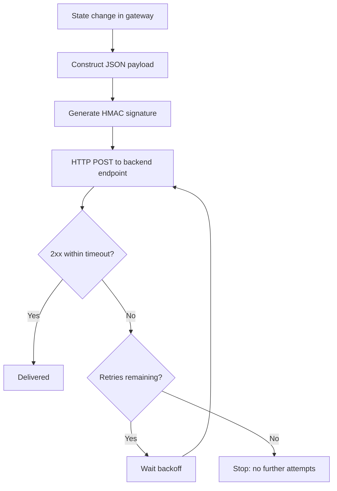

# Webhook Flow

## Purpose

This document describes how Whatsapp Gateway generates, signs, delivers, and retries webhook events.

Webhook delivery is the primary mechanism used to communicate asynchronous state changes to backend systems.

## Webhook Overview

Webhook events are generated for:

- Inbound messages
- Inbound media
- Outbound message status updates
- Queue events
- Failed dispatch events

Webhook delivery is asynchronous and independent from the original API request lifecycle.

## Event Generation

Webhook events are triggered when:

- A new inbound message is received
- An outbound message changes state
- A message fails to send
- A message enters or leaves queue state

Each event contains structured metadata including:

- Event type
- Message identifier
- Timestamp
- Related device/session reference
- Status information (if applicable)

The gateway ensures event generation is consistent with internal state transitions stored in the database.

## Payload Construction

Webhook payloads are constructed as structured JSON objects.

Payload includes:

- Event name
- Message metadata
- Sender or recipient information
- Status details (if applicable)
- Internal tracking identifiers

The payload schema remains stable across versions unless explicitly documented.

### Media Download Behavior

The behavior of media in webhook payloads is controlled by the `WEBHOOK_MEDIA_DOWNLOAD_ENABLED` environment variable.

#### When `WEBHOOK_MEDIA_DOWNLOAD_ENABLED=true` (Recommended)

When media download is enabled, the gateway automatically:

1. Downloads incoming media (images, videos, audio, documents, stickers) from WhatsApp
2. Stores the media in the configured storage provider (S3 or local filesystem)
3. Includes a `media` object in the webhook payload with a `url` pointing to the stored media

**Example media payload:**
```json
{
  "media": {
    "type": "image",
    "mime_type": "image/jpeg",
    "size": 16026,
    "url": "https://s3.amazonaws.com/bucket/media/msg_abc123",
    "caption": "Check this out!"
  }
}
```

**Security Benefits:**
- Presigned S3 URLs are time-limited (24h expiry) and cryptographically signed
- Public local URLs are served from your controlled infrastructure
- Access can be revoked by deleting the stored media
- No dependency on WhatsApp's temporary, unauthenticated URLs

#### When `WEBHOOK_MEDIA_DOWNLOAD_ENABLED=false`

When media download is disabled, the gateway:

1. Does NOT download incoming media from WhatsApp
2. Does NOT include a `media` object in the webhook payload
3. Only provides the `type` field to indicate the message type

**Example text message payload:**
```json
{
  "type": "text",
  "text": "Hello, this is a test message."
}
```

**Example media message payload (no media object):**
```json
{
  "type": "image",
  "message_id": "msg_abc123",
  "timestamp": 1625247600,
  "from": "6281234567890@s.whatsapp.net",
  "chat": "6281234567890@s.whatsapp.net"
}
```

**Trade-offs:**
- Smaller webhook payloads (no media data)
- Faster webhook delivery (no download/upload overhead)
- Media is not persisted (only available via WhatsApp's temporary URL for 5 minutes)
- Backend must implement its own media download logic if needed
- WhatsApp URLs are unauthenticated and pose security risks if intercepted

**Recommendation:**

For production deployments, enable `WEBHOOK_MEDIA_DOWNLOAD_ENABLED=true` for improved security and reliability. The storage provider (S3 or local) should be configured with appropriate access controls and lifecycle policies.

## Signature Generation (HMAC)

Each webhook request includes a signature header.

The signature is generated using:

- Configured shared secret
- HMAC algorithm
- Raw request body

The receiving backend must:

- Extract the signature header
- Recompute HMAC using the shared secret
- Compare signature values securely

Requests with invalid signatures must be rejected.

Webhook signature validation is mandatory for secure deployments.

### Verifying Webhook Signatures

If you provided an `hmac_secret`, webhook requests will include an `X-Webhook-Signature` header of the form `sha256=<hex_signature>`, where the signature is the HMAC-SHA256 of the **raw request body**. Verify it like this:

> The header is `X-Webhook-Signature` (not `X-Signature`) and includes the `sha256=` prefix: strip it before comparing. Compute the HMAC over the **raw bytes**, not a re-serialized object.

**Python Example:**
```python
import hmac
import hashlib

def verify_webhook(raw_body: bytes, signature_header: str, secret: str) -> bool:
    if not signature_header.startswith("sha256="):
        return False
    expected = hmac.new(secret.encode(), raw_body, hashlib.sha256).hexdigest()
    received = signature_header[len("sha256="):]
    return hmac.compare_digest(expected, received)
```

**Node.js Example:**
```javascript
const crypto = require('crypto');

function verifyWebhook(rawBody, signatureHeader, secret) {
  if (!signatureHeader.startsWith('sha256=')) return false;
  const expected = crypto.createHmac('sha256', secret).update(rawBody).digest('hex');
  const received = signatureHeader.slice('sha256='.length);
  return crypto.timingSafeEqual(Buffer.from(expected), Buffer.from(received));
}
```

**Go Example:**
```go
package main

import (
	"crypto/hmac"
	"crypto/sha256"
	"crypto/subtle"
	"encoding/hex"
	"strings"
)

func verifyWebhook(rawBody []byte, signatureHeader, secret string) bool {
	if !strings.HasPrefix(signatureHeader, "sha256=") {
		return false
	}
	mac := hmac.New(sha256.New, []byte(secret))
	mac.Write(rawBody)
	expected := hex.EncodeToString(mac.Sum(nil))
	received := strings.TrimPrefix(signatureHeader, "sha256=")
	return subtle.ConstantTimeCompare([]byte(expected), []byte(received)) == 1
}
```

### `addressing_mode` on incoming webhooks

Incoming-message webhooks include an `addressing_mode` field alongside `from`:

- `"pn"`: `from` is a callable `@s.whatsapp.net` phone number.
- `"lid"`: the only available identifier was an opaque `@lid` (typically a group LID-only participant). Do **not** assume `from` is dialable; treat it as an opaque sender key.

## Delivery Process

Webhook delivery follows this sequence:

1. Construct payload
2. Generate HMAC signature
3. Send HTTP POST request to configured endpoint
4. Await HTTP response

A successful webhook delivery is defined as receiving a successful HTTP status code within the configured timeout.



## Retry Policy

If webhook delivery fails due to:

- Network error
- Timeout
- Non-success HTTP status
- Backend unavailability

The gateway initiates retry attempts.

Retry behavior:

- Retries are limited to a configured maximum attempt count.
- Retries occur sequentially.
- Each retry attempt is recorded internally.

After maximum retry count is reached:

- Delivery attempts stop.
- No further automatic recovery is attempted.

The gateway does not provide dead-letter queue handling for webhook failures.

## Failure Scenarios

Possible failure conditions:

- Backend endpoint unavailable
- Signature mismatch rejection
- Timeout during delivery
- Internal error during payload generation

In these scenarios:

- The gateway logs the failure.
- Retry mechanism applies.
- Final state reflects exhausted retries when limit reached.

## Ordering Guarantees

The gateway does not guarantee strict global ordering of webhook events.

Ordering may be influenced by:

- Queue mode
- Concurrency
- Retry timing

Backend systems should not rely on strict ordering without additional sequencing logic.

## Idempotency Expectations

Webhook events may be retried.

Backend systems must implement idempotency safeguards to avoid duplicate processing.

The gateway does not embed idempotency enforcement at the webhook layer.

## Security Boundary

Webhook endpoint security relies on:

- HMAC signature verification
- HTTPS transport
- Backend access control

The gateway does not enforce mutual TLS by default.

Security hardening should be implemented at infrastructure level if required.

## Observability

Operators should monitor:

- Webhook failure rates
- Retry frequency
- Backend response latency
- Maximum retry exhaustion events

Webhook reliability directly impacts system synchronization between the gateway and backend.
